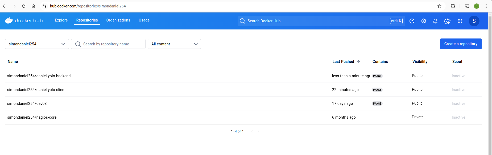

# Screenshot of the Images in Docker

# Begin of Explanation

# 1. Choice of Base Image

The base images used to build the client and backend images are as follows:

Client: node:16-alpine3.16 — Based on Alpine Linux, this lightweight image provides a minimal environment for building the client application.
Backend: node:14-alpine3.16 — An LTS version of Node.js, ensuring long-term support with security patches and stability.
MongoDB: mongo:6.0 — A stable version of the MongoDB database for storing application data.

# 2. Dockerfile Directives

Two Dockerfiles were used: one for the client and one for the backend.

Client Dockerfile
Build Stage:

Dockerfile
Copy code
FROM node:16-alpine3.16 as build-stage
WORKDIR /client
COPY package*.json ./
RUN npm install && npm cache clean --force && rm -rf /tmp/*
COPY . .
RUN npm run build && npm prune --production
Production Stage:

Dockerfile
Copy code
FROM alpine:3.16.7 as production-stage
RUN apk update && apk add npm
WORKDIR /client
COPY --from=build-stage /client/build ./build
COPY --from=build-stage /client/public ./public
COPY --from=build-stage /client/src ./src
COPY --from=build-stage /client/package*.json ./
ENV NODE_ENV=production
EXPOSE 3000
ENV HOST=localhost
CMD ["npm", "start"]
Backend Dockerfile
Build Stage:

Dockerfile
Copy code
FROM node:14 AS build
WORKDIR /usr/src/app
COPY package*.json ./
RUN npm install
COPY . .
Final Image:

Dockerfile
Copy code
FROM alpine:3.16.7
RUN apk add --no-cache nodejs npm
WORKDIR /backend
COPY --from=build /usr/src/app /backend
RUN npm prune --production && npm cache clean --force && rm -rf /tmp/*
EXPOSE 5000
CMD ["npm", "start"]

# 3. Docker Compose Networking

The docker-compose.yml file defines the networking configuration and port mappings for the containers:

yaml
Copy code
services:
  app:
    build:
      context: .
      dockerfile: Dockerfile
    ports:
      - "3000:3000"
    environment:
      - HOST=0.0.0.0
    volumes:
      - ./client:/client
    networks:
      app_network:
        aliases:
          - app
    deploy:
      resources:
        limits:
          memory: "256Mi"
          cpu: "500m"
        reservations:
          memory: "128Mi"
          cpu: "250m"
    command: ["npm", "start"]

networks:
  app_network:
    driver: bridge
In this configuration:

The backend container maps to port 5000.
The client container maps to port 3000.
The MongoDB container maps to port 27017.
All containers are connected to the app_network bridge network.

# 4. Docker Compose Volume Definition and Usage

The docker-compose.yml defines a volume for MongoDB data persistence:

yaml
Copy code
volumes:
  mongodata:
    driver: local
This ensures MongoDB data is retained across container restarts or deletions.

# 5. Git Workflow

To implement the task, the following Git workflow was used:

     #Fork the repository from the original source.
     #Clone the repository: git@github.com:danielsimon254/yolo.git
     #Create a .gitignore file to exclude unnecessary files.
     #Add the Dockerfile for the client: git add client/Dockerfile
     #Add the Dockerfile for the backend: git add backend/dockerfile
     #Commit the changes: git commit -m "Added Dockerfiles"
     #Add the Docker Compose file: git add docker-compose.yml
     #Commit the changes: git commit -m "Added docker-compose file"
     #Push the changes to GitHub: git push
     #Build the client and backend images: docker compose build
     #Push the built images to the Docker registry: docker push ...
     #Deploy the containers using Docker Compose: docker compose up
     #Create the explanation.md file and update it with the commit messages.
